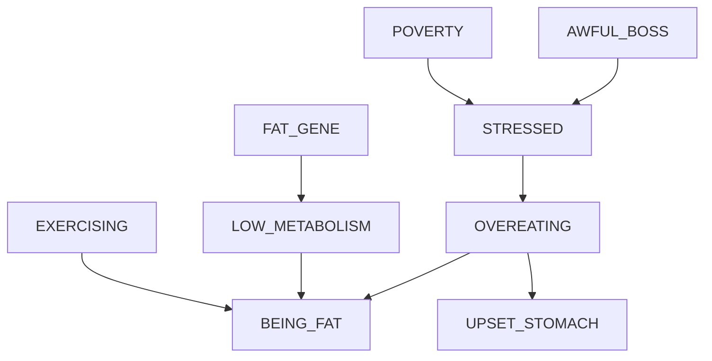

# Causal Network

Here I document in more detail various tests and stuff

Here is the flowchart of the causal diagram used in the tests

## Testing d-Separation

- Given OVEREATING, I would like to test that BEING_FAT is d-separated from UPSET_STOMACH