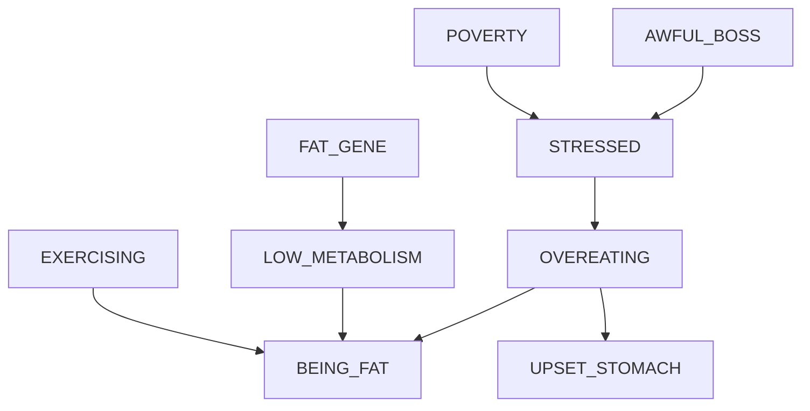

# Causal Network

Here I document in more detail various tests and stuff

Here is the flowchart of the causal diagram used in the tests

## Testing d-Separation

I'd like to test the following d-separation conditions

- X --> A <-- Y 
  - X and Y are blocked IFF A and all its descendants are not controlled
- X --> A --> Y
  - X and Y are blocked if A is controlled
- X <-- A --> Y
  - X and Y are blocked if A is controlled
- X <-- A <-- Y
  - X and Y are blocked if A is controlled