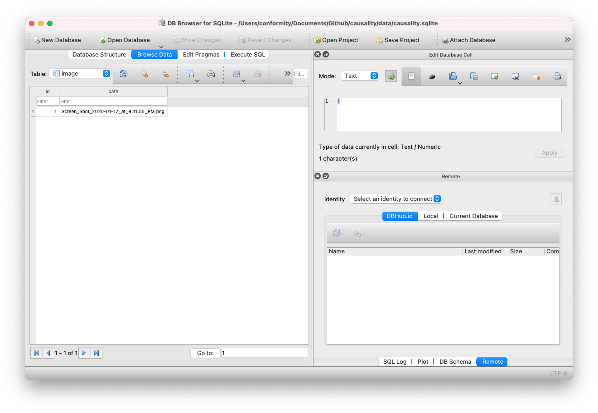

# January 18, 2021 Work Diary

After spending a day literally digging ditches under the hot sun, it's time to get back to setting up the server side to be able to handle sql based data storage. The goal here would be to bring in an ORM into flask.

## Sidenotes

- Sooner or later I'll need to actually put together a structure in the server side

## Update 1

Following along with the [flask sqlachemy](https://flask-sqlalchemy.palletsprojects.com/en/2.x/quickstart/) guide, it seems I'll be incorporating [sql-alchemy](https://www.sqlalchemy.org/) as a part of flask

In anycase, the new dependencies I'll need to add are:

- Flask-SQLAlchemy 
  - [GitHub](https://github.com/pallets/flask-sqlalchemy)
  - [PyPi](https://pypi.org/project/Flask-SQLAlchemy/)

and that's it! Apparently the flask-sqlalchemy package drags in SQLAlchemy on its own

```sh
pipenv install Flask-SQLAlchemy
```

## Update 2

As we expand our functionality, it starts making sense to no longer dump everything into the `__init__.py` file, following in RoR / Ember / Angular convention, I'm going to create a `routes/` directory which will contain all the routes.

Using a bit of elbow grease and reading upon on [python decorators](https://realpython.com/python-lambda/) and [decorator proposal](https://www.python.org/dev/peps/pep-0318/), it seems flask's api easily lends itself into making routes into decorators. If we have the following type

```python
def some_route(get_app: Callable[[], Flask]) -> Callable[[], Flask]:
```

apparently we can just decorate our way into declaring routes in the `__init__.py` file like so

```python
app = Flask(__name__, instance_relative_config=True)

@some_route
@some_other_route
@third_route
def setup_route():
  return app
```

Nifty!

## Sidenote 2

Apparently flask ships with something known as ["blueprints"](https://flask.palletsprojects.com/en/1.1.x/blueprints/) for the purpose of building more modular applications. I _probably_ should investigate this later 

## Sidenote 3

The python equivalent to "commander" (from npm) or thor / rake from Rails is ["click"](https://click.palletsprojects.com/en/7.x/)

In anycase, adding with

```sh
pipenv install click
```

## Update 3

In order to properly setup the db, I'm following along the [flaskr example code](https://github.com/pallets/flask-sqlalchemy/blob/master/examples/flaskr/flaskr/__init__.py)

Below is some stuff I've learned

```python
@click.command("init-db")
@with_appcontext
def init_db_command():
    """Clear existing data and create new tables."""
    init_db()
    click.echo("Initialized the database.")

# Later
app.cli.add_command(init_db_command)
```

Will add another command to flask, allowing for pipenv running via

```sh
pipenv run init_db
```

once I add the new command to my Pipfile

## Protip: Instal the sqlite browser!

Get it [here](https://sqlitebrowser.org/)

Easiest way on macOS is:

```zsh
brew install --cask db-browser-for-sqlite
```

Something I should consider doing is putting together an "ex-nihilo" script that will bootstrap the user from literally nothing (well, at least from the relative nothing of having _just_ bought a brand-new macOS or linux box) into being able to productively work on this project.

I might especially need this as I get deeper into this project and start needing to bring other folks (i.e. gf) into it

## Update 4

Using db-browser-for-sqlite, I can confirm that sqlite db via sqlAlchemy is properly working! (woo!)



## Remaining TODOs

- Figure out a way to properly name uploaded files
- Figure out better error handling on python side (i.e. how-to 500)
- Write up react side screenshot+image upload code
- Connect GraphQL mutations to sql side
