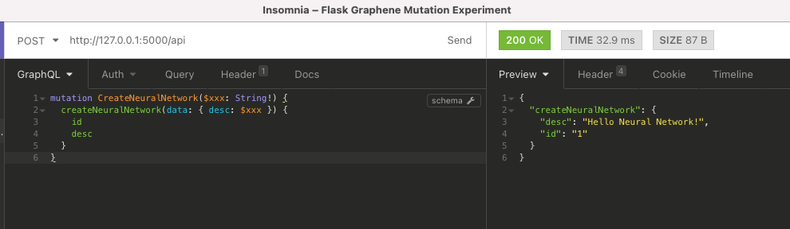

# January 21, 2021 Work Diary

After about 3 days away from this project (due to regular work), it's time to revisit this project

Following up from last time, the objective of today will be to put in the 3 addition tables server side, and get as far as possible in setting up python graphQL mutations for this

## Update

Scaffolded out the 3 tables and now onto declaring the schema in Graphene, going to start with [these examples](https://github.com/graphql-python/graphene/tree/master/examples) and the [guide on mutations](https://docs.graphene-python.org/en/latest/types/mutations/)

## Update 2

After much debugging with various issues of typos, we are now able to correctly mutate the database via graphql through insomnia (woo!)

## TODOs for Next Time

- Need to complete the mutations for the other orm tables
- Need to figure out a way to "migrate" tables without dropping everything
- Still need to rig up react side
- Need to figure out a way to serve back out images
