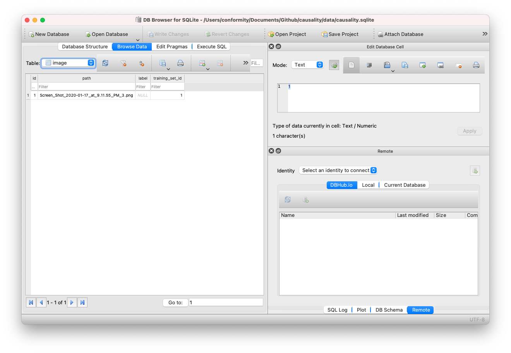

# January 22, 2021 Work Diary

It's Friday night and since I no longer have video games to play, it's back to trying to figure out this stuff. Continuing from last night, I will need to put together the mutations for the remaining orm tables and, ideally setting up migrations

## Update 1

Added a `migrate-db` command, though no idea if it will work (though it appears to work, so maybe...). In any case, going to worry about it not working the next time I need to introduce another orm table

In any case, copying over code for my NeuralNetwork for TrainingSet, everything seems to _just work_(TM) when tested with the following request (via insomnia)

```sh
curl --request POST \
  --url http://127.0.0.1:5000/api \
  --header 'content-type: application/json' \
  --data '{"query":"mutation CreateTrainingSet($name: String!) {\n  createTrainingSet(data: { name: $name }) {\n    id\n    name\n  }\n}","variables":{"name":"Hello training set!"},"operationName":"CreateTrainingSet"}'
```

Next up is the image mutation

## Sidenote

As per [this blog post on python](https://note.nkmk.me/en/python-argument-expand/), python apparently has a "spread" operator similar to javascript's `...` in the form of `*`

```python
def bury_the_light(dog, cat, bat):
  pass

bury_the_light(*["phoenix", "ashes", "divine"])

# Equivalent to:

bury_the_light("phoenix", "ashes", "divine")
```

Going one further than what javascript has ever had, it's also possible to expand a dict into named arguments onto a function like so

```python
def footbart(dog, cat, bat=3):
  pass

footbart(**{ 'dog': 3, 'cat': 4 })

## Equivalent to
footbart(dog=3, cat=4, bat=3)
```

## Update 2

Next, since I have an separate image upload endpoint for uploading images (without going through graphql), I want the ability to associate an image to a training set. I put this together with a `AttachImageToTrainingSet` mutation.

Amazingly enough, it just pretty much works:

```sh
curl --request POST \
  --url http://127.0.0.1:5000/api \
  --header 'content-type: application/json' \
  --data '{"query":"mutation AttachImageToTrainingSet($trainingSetId: ID!, $imageId: ID!) {\n  attachImageToTrainingSet(trainingSetId: $trainingSetId, imageId: $imageId) {\n    id\n    path\n    trainingSet {\n      id\n      name\n    }\n  }\n}","variables":{"trainingSetId":"1","imageId":"1"},"operationName":"AttachImageToTrainingSet"}'
```

and I am able to get the desired response:

```json
{
  "attachImageToTrainingSet": {
    "id": "1",
    "path": "Screen_Shot_2020-01-17_at_9.11.55_PM_3.png",
    "trainingSet": {
      "id": "1",
      "name": "Hello training set!"
    }
  }
}
```

Using the sqlite browser I am indeed able to confirm that it works (woo!)



## Update

In addition, the `mutation LabelImage` also works as expected

```sh
curl --request POST \
  --url http://127.0.0.1:5000/api \
  --header 'content-type: application/json' \
  --data '{"query":"mutation LabelImage($id: ID!, $label: String!) {\n  labelImage(id: $id, label: $label) {\n    id\n    path\n    label\n  }\n}","variables":{"label":"test-label","id":"1"},"operationName":"LabelImage"}'
```

we get this response

```json
{
  "labelImage": {
    "id": "1",
    "label": "test-label",
    "path": "Screen_Shot_2020-01-17_at_9.11.55_PM_3.png"
  }
}
```

## TODOs for Next Time

So now that I've finished up with putting together all the mutations I need, next steps are as follows

- Put together Query types
- Wire up react-side to enable actually hitting the back-end
  - Set-up server side to serve static images (so that I can properly label)
- Eventually, I'd want to put in a test framework on the server side
