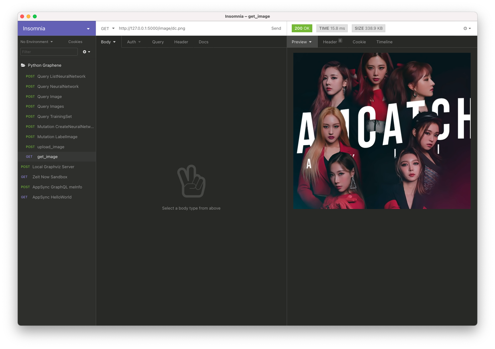

# January 24, 2021 Work Diary

After a rainy Saturday of running and relaxing (I really should figure out something better to do other than just browsing youtube), it's Sunday and so it's time to get back to figuring out how this stuff works.

Anyway today I'm looking to:

- Setup client-side react code to use new api
- Learn and write up GraphQL queries

## Update

We'll start with writing queries. I'll be pulling from [these examples](https://github.com/graphql-python/graphene/blob/master/examples/starwars/schema.py) and the [documentation](https://docs.graphene-python.org/projects/django/en/latest/queries/)

## Sidenote: Static v. class methods

As per [this article](https://www.geeksforgeeks.org/class-method-vs-static-method-python/) apparently python's `staticmethod` and `classmethod` decorators are different, notably, `@classmethod` receives a reference to the class itself as the first argument

## Update 2

GraphQL queries for network-networks now works as expected (yay!). Research into [graphene-django docs](https://docs.graphene-python.org/projects/django/en/latest/queries/) suggests that django models are automagically converted into graphql objects by the structure, which is a fairly attractive selling point for me to switch to django one day.

In the meantime, however, I've just introduced an addition `data.py` file that will handle the conversion between a flask-sqlalchemy orm row into a graphene model. For the time being, an api of something like the following should be good

```python
class Data:
    @staticmethod
    def find_by_id(id):
      pass
    
    @staticmethod
    def record_to_object(record):
      pass

    @staticmethod
    def list(offset = 0, limit=100):
      pass
```

## Update 3

Completed queries for all GraphQL models, now to move onto being able to serve out the image.

For reference, this [github issue](https://github.com/graphql-python/graphene/issues/657) answered for the question of how to load parameters into `graphene.List`, TL;DR is that it works just like a field

```python
graphene.List(SomeField, id=graphene.ID(required=True))
```

Next up, I will need to get flask to serve static image files so that it's easy for me to observe what I've uploaded

## Update 4

Apparently, the recommenation from [this stackoverflow question](https://stackoverflow.com/questions/20646822/how-to-serve-static-files-in-flask) is as follows

- use nginx to serve static files (not flask)
- if I must use flask, then use the `send_from_directory` method [documented here](https://flask.palletsprojects.com/en/1.1.x/api/#flask.send_from_directory)
- check [this tutorial](https://pythonbasics.org/flask-tutorial-routes/) for howto: flask routes with parameters

Using the trick with `send_from_directory` is apparently that its reference of relative  directory is different from the flask upload method, as such, I had to pass in an absolute directory with `os.getcwd()`. In anycase, this now works and flask now serves static image assets that we've uploaded



Next up, I will need to work on the react side to rig up the ability to interface with the python side api

## Appendix

### Feelings unrelated to this project

Recently ordered Stephen Wolfram's book "New Kind of Science", perhaps there is something about hypergraphs and whatnot in there that I can use in better understanding how the graphical structure of causality works for the purposes of this project.

Also, on days when I'm not pushing this project forward, I should consider reviewing some of my still outstanding "thesis ideas" and see if I can make a video essay out of them

I should also consider switching over to [django](https://www.djangoproject.com/) as necessary
