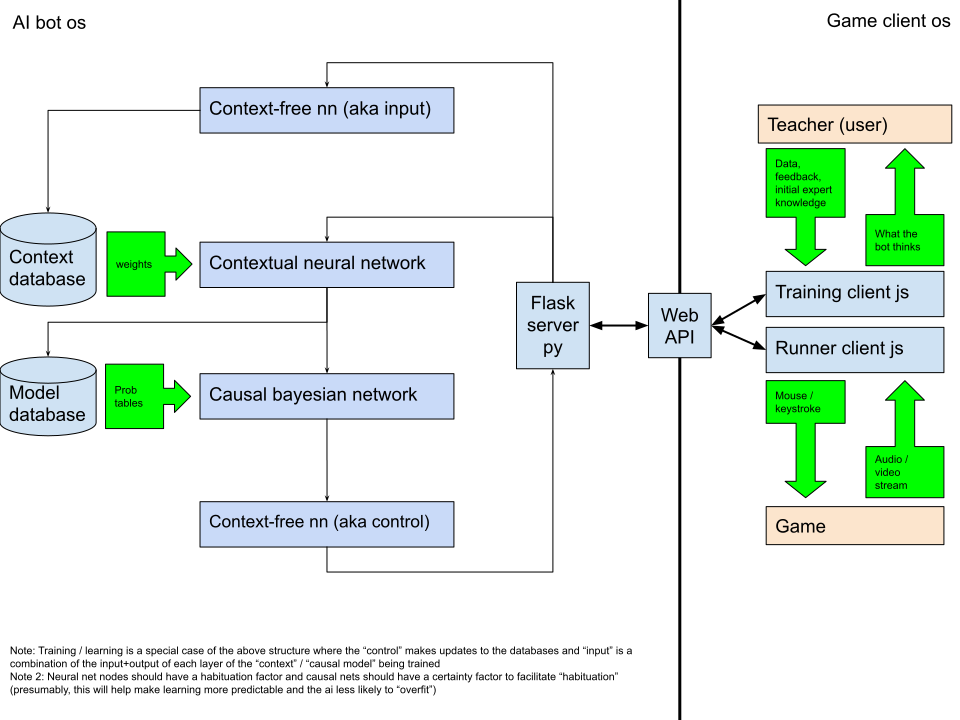

# Architecture and Specs

The objective of the causality project is to put together a general automation framework where we have:

- input from video / audio stream
- control output in the form of clicks and key strokes

## Features

The software here should do the following:

- Provide an UI with which to train the AI
- AI should consume input AV
- AI should be able to interact with clicks and keystrokes
- AI should be able to play LoL
- There should be an intermediate language between AV input and control clicks to the league client
- There should be a way of storing data into a local database

## References

- [drive: structural diagram](https://docs.google.com/drawings/d/1DxbMOw0euA1VaXwIsjwfVcaSjDMGdqe9DOwypfDv6_I/edit)
- [Python Flask: micro web framework](https://flask.palletsprojects.com/en/1.1.x/)
- [Howto: put together a screen capturer in python](https://www.thepythoncode.com/article/make-screen-recorder-python)
- [Structure of a python project](https://realpython.com/python-application-layouts/)
- [TensorFlow guide to keras docs](https://www.tensorflow.org/guide/keras/sequential_model)
- [GitHub: DeepFaceLab - aka deep fakes](https://github.com/iperov/DeepFaceLab)
- [Python tutorial](https://docs.python.org/3/tutorial/index.html)
- [Stack Overflow: Bash string regex match](https://stackoverflow.com/questions/21112707/check-if-a-string-matches-a-regex-in-bash-script)
- [GitHub: pyenv](https://github.com/pyenv/pyenv)
- [Guide: Introduction to Pipenv](https://realpython.com/pipenv-guide/)
- [Causality](http://bayes.cs.ucla.edu/BOOK-2K/book-toc.html)
- [associated homework assignments](http://bayes.cs.ucla.edu/BOOK-2K/viewgraphs.html)